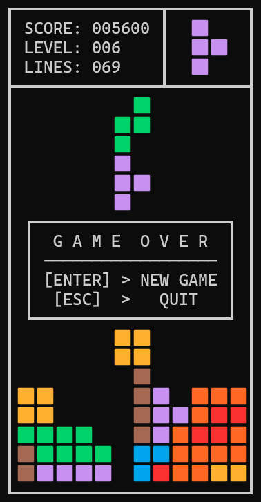

# TetrisX – Zero-Sleep, LUT-Driven O(1) Terminal Arcade Engine

    

A high-performance, ultra-optimized, terminal-based Arcade Tetris implementation written in modern C++20. This project completely eschews external game engines (like Raylib) and multithreading, relying instead on compile-time Look-Up Tables (LUTs), hardware-inspired logic, and strict memory efficiency to deliver buttery-smooth 50 FPS gameplay directly in the console.

<p align="center">
  
  <br>
  <em>Figure 1: TetrisX runtime execution displaying the unified terminal HUD, next-piece preview matrix, and the custom encapsulated state-reset overlay triggered upon Game Over.</em>
</p>

---

## 🧠 The Challenge & Philosophy

Developing an action-oriented arcade game within a standard terminal environment presents critical hurdles. Without a dedicated engine, every rendering cycle, input query, and state transition must be exceptionally fast. Even minor inefficiencies would instantly result in screen tearing, input lag, or unplayable stuttering.

TetrisX solves this by treating software design with a hardware-near mindset:
* **Zero-Sleep Main Loop:** The game ticks at a precise 20 ms frame rate without putting the CPU thread to sleep, keeping execution incredibly responsive while maintaining minimal CPU usage.
* **Deterministic Completion Routine:** Line clearing executes a specialized, multi-stage Finite State Machine (FSM) decoupled from game velocity. When rows are completed, cells cycle fluidly through precise visual shattering phases (💥 $\rightarrow$ 💢) across subsequent frame dispatches without sleeping the CPU thread. The ultimate downward board shift utilizes a localized stack short-circuit: it copies rows via dynamic index offsets and instantly terminates (`break`) the moment it encounters the first completely empty row above the impacted zone, completely eliminating redundant array traversal.
* **Strict Input Decoupling:** Managing automatic downward gravity versus user-triggered soft drops requires precise edge-detection logic. When a block impacts a solid surface, the player is forced to release the DOWN arrow before a new input is registered, preventing accidental misplacements.

---

## ⚡ Technical Deep Dive & Optimizations

### 📊 Compile-Time LUT-Driven Architecture
To achieve instantaneous calculations, TetrisX moves the heavy lifting to compile-time using extensively configured Look-Up Tables (LUTs).
* **O(1) Transformations:** Rotations for all 4 orientations of the 7 tetromino types are pre-calculated. Rotating a block is a trivial compile-time index addition.
* **Cache-Friendly Board:** The 2D matrix of the playing field is flattened into a highly efficient 1D array, keeping the entire game board local within the CPU cache.
* **Static Elements:** High-score calculations, level speeds, title headers, and even complex screens like the GAME OVER template and the "Next Block" preview box are served via raw, flat data structures.

### ⛓️ Short-Circuit Loops & Smart Indexing
Loops are designed to bail out at the absolute earliest opportunity ($O(1)$ optimal execution via a maximum of 4 iterations):
* **Pre-calculated Collision Vectors:** Movement checking handles horizontal shifts, gravity drops, and rotations via the same unified pipeline. By applying pre-calculated offsets (`Configs::ROT_3X3`, `COLS`, etc.) directly to the 1D board index, target cells are validated instantly. The routine short-circuits and bails out (`return`) the moment a single collision is detected.
* **Bidirectional Memory Preservation:** To update the 1D board array without allocating auxiliary buffer memory, the game loop dynamically flips its iteration direction. Leftward movements iterate in ascending order, while rightward and downward movements utilize `std::views::reverse`. This directional flipping prevents active block cells from overwriting their own adjacent data during shifts.
* **Modulo Elimination for Rotation Phases:** To maintain maximum ALU efficiency, the engine bypasses high-cost hardware division operations during rotation state updates. Instead of a standard modulo operator (`% 4`), a highly predictable branch-check handles the 4-phase clockwise rotation state fluidly.
* **Post-Rotational Index Alignment:** Since the directional movement logic relies strictly on an ascending sequence of coordinates, a high-performance `std::ranges::sort` is executed exclusively after a successful rotation to guarantee template conformity for subsequent frames.
* **Localized Line Checking:** Upon a block landing, the line-clear algorithm does not check the entire board. It limits its scan exclusively to a maximum of 4 rows upwards from the lowest impact point.

### ⚙️ Core Mechanics
* **7-Bag Randomizer:** Perfectly replicates official Tetris guidelines. Block generation shuffles a sequence of 7 unique pieces, guaranteeing a fair distribution. Grabbing the next piece is a pure O(1) operation.
* **Hard-Capped Smart Level Progression:** Every 10 cleared lines increases the level. Game speed accelerates dynamically based on a rigid hardware delay array. Once the absolute maximum speed is hit (50 ms ticks), level increments stop, capping the game at peak difficulty.
* **Official Score Table:** Scores scale exponentially based on single, double, triple, or Tetris clears via an exact score LUT.

---

## 📂 Repository Structure

```text
TetrisX/
├── image/
│   └── showcase.png      # Game terminal screenshot highlighting HUD components and Game Over overlay
├── src/
│   ├── AsyncKey.h        # OS-specific terminal setup and non-blocking input handlers
│   ├── TetrisX.h         # Core engine architecture, compile-time UI templates, and constexpr LUTs
│   ├── TetrisX.cpp       # Main game loop, FSM line-clearing, and O(1) movement execution
│   └── main.cpp          # Application entry point containing ancestral ASCII planning grids
├── .gitignore            # Specifies intentionally untracked files to ignore
├── LICENSE               # MIT License File
└── README.md             # Project documentation and architecture overview
```

### Module Breakdown

* **`AsyncKey.h`:** Contains the OS-specific low-level terminal abstraction and non-blocking input configurations. It synchronizes keypress events asynchronously across separate operating system kernels, ensuring that rapid-fire key repeats fluidly translate to instant game reactions without freezing the execution thread.
* **`TetrisX.h`:** Formulates the entire engine architecture and object layouts. It divides state management into dynamic `Cell` tracking (representing the game board matrix with instant color-ID resolution via `VISUALS[Cell.id]`) and active `B_Cell` structures (driving the currently controlled block by linking 1D board indices with coordinate offsets and rotation phases). Furthermore, it embeds complete compile-time UI templates alongside extensive `constexpr` Look-Up Tables (LUTs) managing game velocities, rotation phase shifts, and initial spawn vectors.
* **`TetrisX.cpp`:** Implements the core arcade engine execution loops and state transitions. It manages the rigid 20 ms tick cadence, the deterministic finite state machine (FSM) for line-clearing animations, and houses the primary movement functions. By evaluating collisions ahead of time through a customized `MoveInfo` structure, it short-circuits loops instantly upon block obstruction or simultaneously saves pre-sorted indices to perform valid board shifts in pure O(1) complexity.
* **`main.cpp`:** Functions as the minimalist application bootstrap, initializing the `TetrisX` instance and triggering execution. It acts as an archival repository for the engine's architectural blueprint, encapsulating raw, immutable ASCII planning grids, block insertion layouts, and tetromino coordinate matrices formulated during the initial hardware-near design phase.

---

## 🕹️ Controls

| Key | Action |
| :--- | :--- |
| `ARROW UP` | Rotate Clockwise |
| `ARROW LEFT` | Move Left (Decoupled input) |
| `ARROW RIGHT` | Move Right (Decoupled input) |
| `ARROW DOWN` | Soft Drop (Rapid-fire enabled, auto-decouples upon impact) |
| `ENTER` | Restart Game (Only active on GAME OVER screen) |
| `ESC` | Instant Quit (Available at any time) |

---

## 📋 Prerequisites & Dependencies

This project is fully cross-platform, supporting both Windows and Linux environments without modifying the core game logic.

### 🪟 Windows
* **Compiler:** GCC/MinGW (with C++20 support)

### 🐧 Linux
* **Compiler:** GCC or Clang (with C++20 support)
* **Libraries:** Native X11 development library (`libX11`).
* **Package Installation (Debian/Ubuntu):** `sudo apt-get install libx11-dev`
* **Package Installation (Arch/CachyOS):** Standard package `libx11` comes pre-installed, header files are provided by default.

---

## 🛠️ Compilation

Ensure you are in the project's root directory containing the source files before compiling.

```bash
# Clone the repository
git clone https://github.com/iibram/TetrisX.git

# Change directory
cd TetrisX
...
```

### 🪟 Windows (Native Console)
To compile under Windows via MinGW/GCC:

```bash
...
# Compile all source files with high-level performance optimization
g++ -std=c++20 -O2 src/*.cpp -o tetris

# Run the engine
./tetris
```

### 🐧 Linux (Native X11 Execution)
To compile under Linux, you **must** explicitly link the X11 library using the `-lX11` flag:

```bash
...
# Compile all source files with high-level performance optimization
g++ -std=c++20 -O2 src/*.cpp -o tetris -lX11

# Run the engine
./tetris
```

---

## 🗺️ Roadmap & Features

### ✅ Done
- [x] **Cross-Platform Compatibility** (Native execution on Windows & Linux / CachyOS)
- [x] **Memory-Optimized FSM** (Finite State Machine operating on ultra-low footprint `uint8_t` data types)
- [x] **Encapsulated Terminal Setup** (Refactored out of main loop for clean engine boundaries)
- [x] **Smart Velocity Cap** (Hard-capped level-up system preventing loop overhead at max speed)
- [x] **7-Bag Randomizer System** (Authentic random distribution without modulo operations)

### 🚀 In Progress / Upcoming
- [ ] **Center the Game in Console** (Dynamic terminal window bounds scanning for centered UI rendering)
- [ ] **Advanced Soft Drop Point Scoring** (Adding additional value ticks when forcing blocks down)
- [ ] **Highscore List Persistence** (Saving absolute best scores to a lightweight local file)
- [ ] **Advanced Line-Clear Animations** (Expanding the custom FSM to display visual row-shattering effects)

---

## 📄 License
This project is licensed under the MIT License - see the [LICENSE](LICENSE) file for details.
